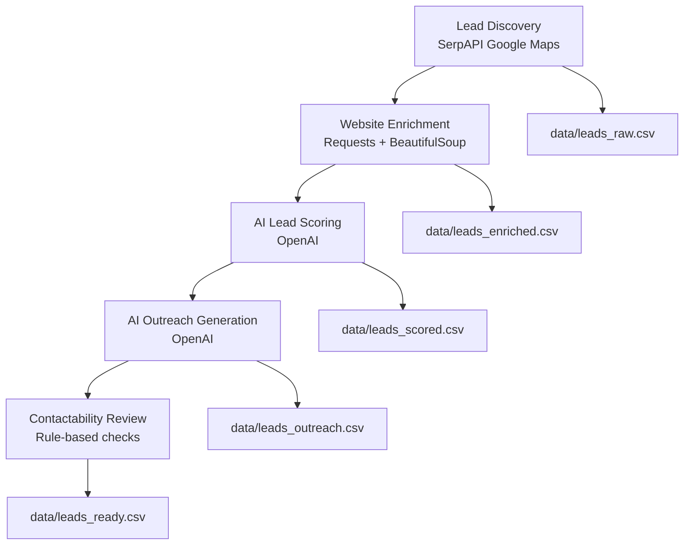

# AI Lead Generation Agents

An end-to-end AI pipeline that discovers local businesses, analyzes their websites, scores potential outreach opportunities, and generates personalized cold emails for follow up.

This project demonstrates how AI agents can automate parts of the B2B lead generation workflow.

---

# Overview

This system automatically:

1. **Discovers leads**
   - Uses Google Maps via SerpAPI to find local businesses.

2. **Enriches websites**
   - Fetches and parses homepage content.
   - Detects conversion signals like:
     - booking systems
     - contact forms
     - chat widgets
     - technology stack hints.

3. **Scores leads with AI**
   - Uses an LLM to evaluate outreach potential.
   - Generates structured scoring insights.

4. **Generates personalized outreach**
   - Creates cold email drafts and follow-ups tailored to each lead.

5. **Applies contactability checks**
   - Flags leads that require manual review.

---

# Pipeline Architecture



Outputs are saved as CSV datasets at each stage.

---

# Project Structure

```text
ai-lead-generation-agents/
├── data/
│   ├── leads_raw.csv
│   ├── leads_enriched.csv
│   ├── leads_scored.csv
│   ├── leads_outreach.csv
│   └── leads_ready.csv
├── scripts/
│   ├── run_lead_discovery.py
│   ├── run_enrichment.py
│   ├── run_scoring.py
│   ├── run_outreach.py
│   ├── run_contactability.py
│   └── run_pipeline.py
├── src/
│   ├── lead_sources/
│   │   └── serpapi_maps.py
│   ├── enrichment/
│   │   └── website_enricher.py
│   ├── scoring/
│   │   └── lead_scorer.py
│   └── outreach/
│       ├── email_generator.py
│       └── contactability.py
├── .env.example
├── requirements.txt
├── README.md
└── LICENSE
```

---

# Setup

## 1. Clone the repository

```bash
git clone https://github.com/paureis/ai-lead-generation-agents.git
cd ai-lead-generation-agents
```

---

## 2. Install dependencies

```bash
pip install -r requirements.txt
```

---

## 3. Configure API keys

Create a `.env` file in the project root.

```bash
OPENAI_API_KEY=<your_key_here>
SERPAPI_API_KEY=<your_key_here>
```

You can copy the template:

```bash
cp .env.example .env
```

---

# Running the Pipeline

Run the full pipeline with one command:

```bash
python scripts/run_pipeline.py
```

This will automatically execute:

1. Lead discovery  
2. Website enrichment  
3. AI scoring  
4. Outreach generation  
5. Contactability review  

---

# Example Output

Example generated lead:

Business: Miami Dental Group  
Score: 6  

Opportunity:  
Add a live chat feature to capture more patient inquiries.

Generated Outreach Email:

Hi Miami Dental Group Team,

I noticed your practice has a strong online reputation with over 1,000 reviews. One opportunity that might help increase patient inquiries is adding a live chat feature to your website so visitors can ask questions instantly.

I'd be happy to share a few ideas if you're open to it.

---

# Technologies Used

- Python
- OpenAI API
- SerpAPI
- Pandas
- BeautifulSoup
- Requests

---

# Future Improvements

Potential extensions:

- automated email sending
- CRM integrations
- scheduling outreach sequences
- better website tech detection
- lead scoring fine-tuning
- dashboard UI
- automated niche discovery

---

# License

MIT License
