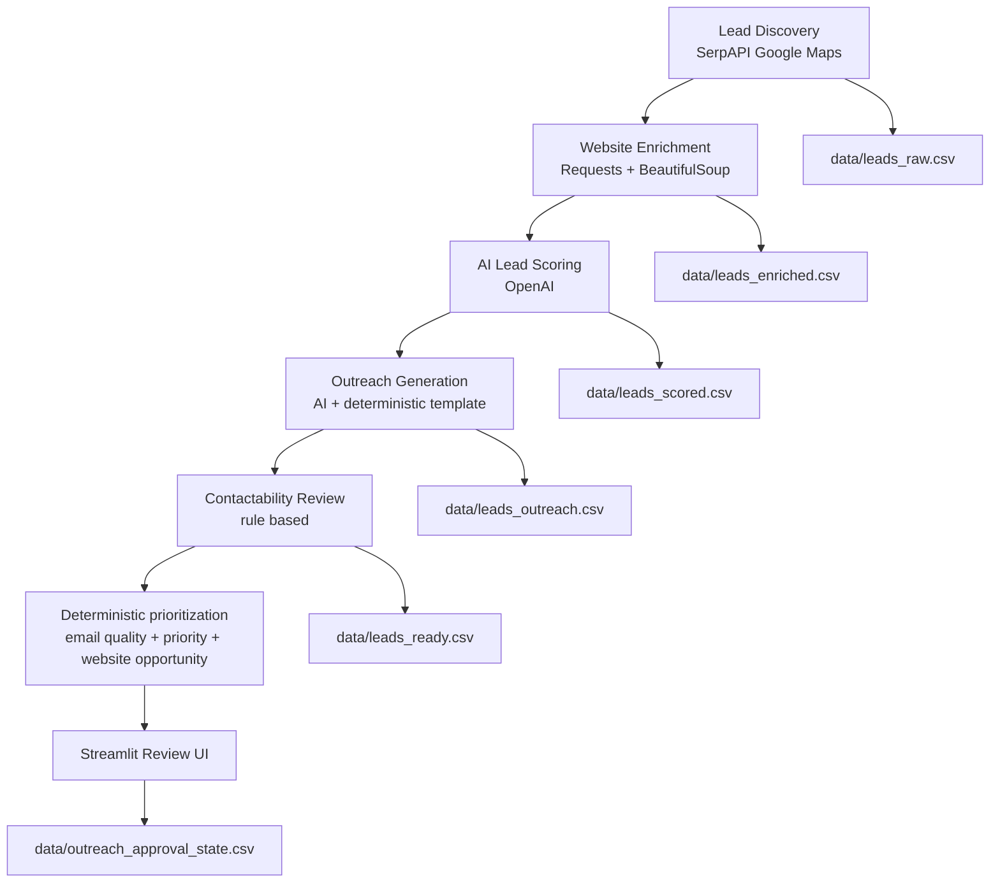

# AI Lead Generation Agents

End-to-end **AI-powered lead generation platform** for discovering, analyzing, and contacting local businesses.

The system automatically:
- discovers local business leads from Google Maps
- enriches websites and contact data
- scores business opportunities using AI
- generates personalized outreach drafts
- allows human review and approval
- exports outreach-ready lead lists
- runs in a cloud-hosted Streamlit dashboard

The application is now successfully deployed using **Docker + AWS ECS Fargate** and can be run on-demand for demos.

---

## Live Demo

The system is deployed on **AWS ECS Fargate**.

Because the infrastructure runs in on-demand demo mode, the instance is started only when needed.

To request a live demo:

Contact: `alvaro.reis@email.com`

When active, the application is available at:

`http://<ecs-public-ip>:8501`

---

## What The App Does Today

### Core pipeline

1. **Lead Discovery**
   - Uses SerpAPI Google Maps search
2. **Website Enrichment**
   - website scraping
   - SEO signals
   - contact email extraction
   - tech stack hints
3. **AI Lead Scoring**
   - uses OpenAI models to identify growth opportunities
4. **Outreach Generation**
   - AI-generated outreach drafts
   - structured audit-style messaging
5. **Contactability Review**
   - deterministic checks for reachable contacts

---

## Additional Scoring Layers

Deterministic scoring layers improve prioritization.

### Email quality scoring

- `contact_email_quality`
- `contact_email_score`

Evaluates prefixes such as:
- `info@`
- `hello@`
- `support@`
- `sales@`

### Lead priority scoring

- `lead_priority_score`
- `lead_priority_label`

Scores leads from `0-100` using:
- AI score
- contactability
- opportunity signals

### Website opportunity scoring

- `website_opportunity_score`
- `website_opportunity_label`

Signals include:

| Signal | Score |
|---|---|
| Missing booking system | +35 |
| Missing contact form | +20 |
| Missing live chat | +15 |
| SEO weaknesses | +10 |
| Weak tech stack | +5 |

---

## Streamlit Dashboard

Operational UI built with **Streamlit**.

### Main dashboard sections

- Pipeline run summary
- Lead map visualization
- Approval summary
- Outreach queue
- Top opportunities
- Other scored leads
- Lead detail expanders
- Growth report PDF export

Note: the app intentionally does **not** include stage timings, queue-size slider, or lifecycle dashboard bulk actions in the current UI.

---

## Streamlit UI Features

### Sidebar controls

- Niches
- Cities
- Maximum leads
- Outreach limit
- Minimum opportunity score
- High opportunity only
- Require missing booking
- Require missing live chat
- Require website
- Export mode

### Lead map

Interactive map powered by **PyDeck** with:
- dark-themed map
- multi-city discovery
- city jump selector
- `All Cities` view
- coordinate fallback geocoding

### Outreach queue

The queue includes only leads where:
- `contactability_status == "ready"`
- generated `email` exists (non-empty after strip)

Sorting:
- `lead_priority_score` descending
- fallback: `score` descending

Per-lead actions:
- Approve to send
- Skip lead
- Edit subject
- Edit email
- Edit CTA
- Copy helpers
- Open business website

---

## Outreach Approval Persistence

Human review state persists between runs.

Stored in:

`data/outreach_approval_state.csv`

Stable lead key:

`name|website|search_city|best_contact_email`

Stored metadata includes:
- approval flags
- edited outreach text
- workflow status
- send status
- reply status
- timestamps

---

## Exports

### Export modes
- Outreach Ready
- Lead List Only
- CRM Upload

### Queue exports
- Outreach Queue CSV
- Approved Outreach CSV

Edited outreach text is preserved in exports.

---

## Pipeline Architecture


```mermaid
flowchart TD
    A[Lead Discovery<br/>SerpAPI Google Maps] --> B[Website Enrichment<br/>Requests + BeautifulSoup]
    B --> C[AI Lead Scoring<br/>OpenAI]
    C --> D[Outreach Generation<br/>AI + deterministic template]
    D --> E[Contactability Review<br/>rule based]
    E --> F[Deterministic prioritization<br/>email quality + priority + website opportunity]
    F --> G[Streamlit Review UI]

    A --> A1[data/leads_raw.csv]
    B --> B1[data/leads_enriched.csv]
    C --> C1[data/leads_scored.csv]
    D --> D1[data/leads_outreach.csv]
    E --> E1[data/leads_ready.csv]
    G --> G1[data/outreach_approval_state.csv]
```

---

## Cloud Deployment Architecture

The application is containerized and deployed on AWS ECS Fargate.

```text
Internet
  ->
Public IP
  ->
ECS Fargate Task
  ->
Docker Container
  ->
Streamlit App (Port 8501)
```

Key infrastructure components:
- Docker container
- AWS ECS Fargate
- AWS ECR container registry
- AWS Secrets Manager
- ECS security groups
- public IP networking

---

## Deployment Workflow (On-Demand Demo Mode)

The demo is designed to run on-demand to minimize cloud costs.

### Start demo
1. ECS -> Cluster -> `ai-leadgen-service`
2. Update Service
3. Set desired tasks = `1`
4. Wait about 60 seconds
5. Find public IP:
   - ECS -> Tasks -> Networking
6. Open:
   - `http://PUBLIC-IP:8501`

### Stop demo
1. Update Service
2. Set desired tasks = `0`

This stops compute usage when idle.

### Cost profile
- Idle: `$0`
- Running (demo mode): approximately `$0.02/hour` (varies by region/configuration)

---

## Data Outputs

Pipeline generates:
- `data/leads_raw.csv`
- `data/leads_enriched.csv`
- `data/leads_scored.csv`
- `data/leads_outreach.csv`
- `data/leads_ready.csv`
- `data/outreach_approval_state.csv`

---

## Project Structure

```text
ai-lead-generation-agents/
|- app/
|  |- streamlit_app.py
|  \- auth_gate.py
|- data/
|  |- leads_raw.csv
|  |- leads_enriched.csv
|  |- leads_scored.csv
|  |- leads_outreach.csv
|  |- leads_ready.csv
|  \- outreach_approval_state.csv
|- scripts/
|  |- run_lead_discovery.py
|  |- run_enrichment.py
|  |- run_scoring.py
|  |- run_outreach.py
|  |- run_contactability.py
|  \- run_pipeline.py
|- src/
|  |- lead_sources/
|  |  \- serpapi_maps.py
|  |- enrichment/
|  |  \- website_enricher.py
|  |- scoring/
|  |  \- lead_scorer.py
|  \- outreach/
|     |- email_generator.py
|     \- contactability.py
|- .github/workflows/
|  \- build-and-push.yml
|- .env.example
|- requirements.txt
|- Dockerfile
|- README.md
\- LICENSE
```

---

## Setup

### Clone

```bash
git clone https://github.com/paureis/ai-lead-generation-agents.git
cd ai-lead-generation-agents
```

### Install dependencies

```bash
pip install -r requirements.txt
```

### Configure environment variables

Create a `.env` file:

```bash
OPENAI_API_KEY: <your_key>
SERPAPI_API_KEY: <your_key>
APP_BASIC_AUTH_USERNAME: <username>
APP_BASIC_AUTH_PASSWORD: <password>
```

In production, these values are loaded from AWS Secrets Manager.

---

## Run Locally

Start the Streamlit dashboard:

```bash
streamlit run app/streamlit_app.py
```

Run pipeline via CLI:

```bash
python scripts/run_pipeline.py
```

---

## Docker Deployment

Build container:

```bash
docker build -t ai-leadgen .
```

Run locally:

```bash
docker run --rm -p 8501:8501 --env-file .env ai-leadgen
```

---

## Tech Stack

### Backend
- Python
- Pandas
- Requests
- BeautifulSoup

### AI
- OpenAI API

### Data source
- SerpAPI Google Maps

### Visualization
- Streamlit
- PyDeck
- Geopy

### Reporting
- ReportLab

### Infrastructure
- Docker
- AWS ECS Fargate
- AWS ECR
- AWS Secrets Manager

---

## Future Improvements

Planned improvements:
- automated outreach sending
- CRM integrations
- lead database persistence
- SaaS multi-user support
- automated scheduling
- analytics dashboards

---

## License

MIT License
