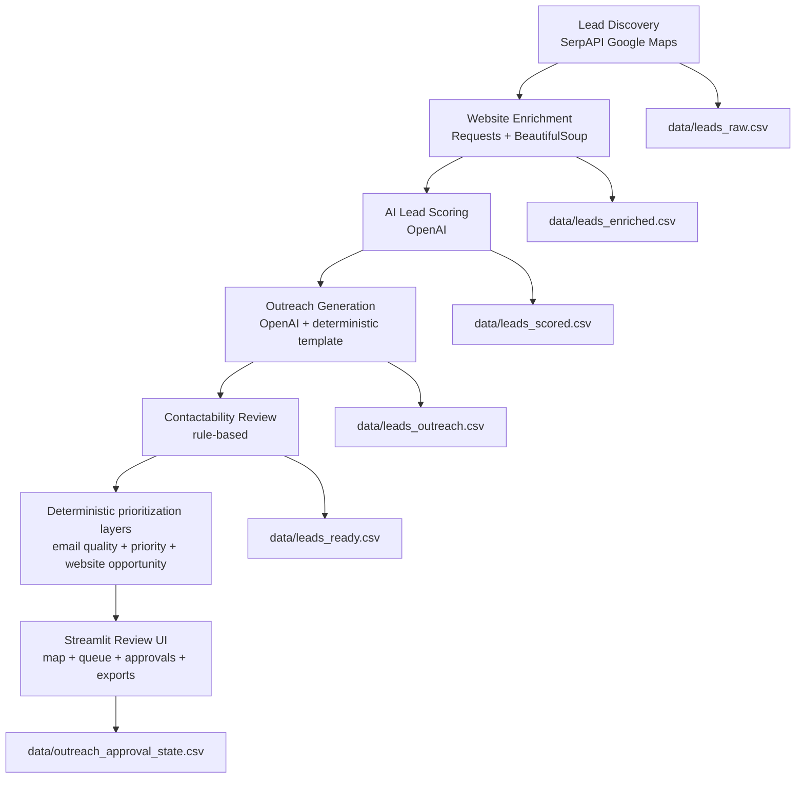

# AI Lead Generation Agents

End-to-end AI lead generation workflow for local businesses:
- discovers leads from Google Maps
- enriches websites and contact data
- scores opportunities
- generates outreach drafts
- supports human approval in a Streamlit UI
- persists outreach review state to CSV

## What The App Does Today

### Core pipeline
1. Lead discovery (SerpAPI Google Maps)
2. Website enrichment (signals, SEO, contact emails, tech hints)
3. AI lead scoring
4. Outreach generation (with an audit-style outreach template)
5. Contactability review

### Additional scoring layers
- `contact_email_quality` and `contact_email_score` (deterministic, based on email prefix quality)
- `lead_priority_score` and `lead_priority_label` (deterministic 0-100 prioritization)
- `website_opportunity_score` and `website_opportunity_label` (deterministic website opportunity scoring)

### Streamlit UI (simplified operational layout)
- Title and run summary
- Pipeline Results metrics
- Lead Map with city jump selector (`All Cities` + per-city selection)
- Approval Summary
- Download Approved Outreach CSV
- Outreach Queue
- Top Opportunities
- Other Scored Leads
- Lead Details + Growth Report PDF download

The UI intentionally removes experimental/testing-heavy sections such as stage timings and the lifecycle dashboard table.

## Pipeline Architecture


```mermaid
flowchart TD
    A[Lead Discovery<br/>SerpAPI Google Maps] --> B[Website Enrichment<br/>Requests + BeautifulSoup]
    B --> C[AI Lead Scoring<br/>OpenAI]
    C --> D[Outreach Generation<br/>OpenAI + deterministic template]
    D --> E[Contactability Review<br/>rule-based]
    E --> F[Deterministic prioritization layers<br/>email quality + priority + website opportunity]
    F --> G[Streamlit Review UI<br/>map + queue + approvals + exports]

    A --> A1[data/leads_raw.csv]
    B --> B1[data/leads_enriched.csv]
    C --> C1[data/leads_scored.csv]
    D --> D1[data/leads_outreach.csv]
    E --> E1[data/leads_ready.csv]
    G --> G1[data/outreach_approval_state.csv]
```

## Streamlit Features

### Sidebar controls
- Niches (multi-line)
- Cities (multi-line)
- Max Leads
- Outreach Limit
- Minimum Opportunity Score
- High Opportunity Only
- Require Missing Booking
- Require Missing Live Chat
- Require Website
- Export Mode (`Outreach Ready`, `Lead List Only`, `CRM Upload`)

### Map behavior
- Renders leads on a dark pydeck map
- Supports city jump selector
- Supports `All Cities` view centered by plotted lead coordinates
- Uses available coordinates and geocoding fallback for missing coordinates

### Outreach Queue behavior
- Shows only leads where:
  - `contactability_status == "ready"`
  - generated `email` is non-empty
- Sorted by:
  - `lead_priority_score` descending (fallback to `score` if needed)
- Per-lead controls:
  - `Approved to Send` / `Skip This Lead` (mutually exclusive)
  - editable `subject`, `email`, `cta`
  - copy helpers + open website button
- Per-lead review state is persisted in session and CSV

## Outreach Approval Persistence

Approval/review state is persisted to:

`data/outreach_approval_state.csv`

Stable key per lead:

`name|website|search_city|best_contact_email` (with fallback handling)

Persisted state includes operational fields such as:
- approval flags (`approved_to_send`, `skip_this_lead`)
- edited outreach content (`edited_subject`, `edited_email`, `edited_cta`)
- workflow/send/reply metadata (`workflow_status`, `send_status`, `reply_status`, etc.)
- timestamps (`approved_at`, `queued_to_send_at`, `sent_at`, `replied_at`, `meeting_booked_at`, `last_reviewed_at`)

Loader/saver logic deduplicates by `lead_key` and keeps the latest record per lead.

## Exports

### Main export modes
- Outreach Ready
- Lead List Only
- CRM Upload

### Queue exports
- Outreach Queue CSV (currently visible queue rows)
- Approved Outreach CSV (approved visible queue rows, using edited subject/email/cta values)

## Data Outputs

Generated CSV files:
- `data/leads_raw.csv`
- `data/leads_enriched.csv`
- `data/leads_scored.csv`
- `data/leads_outreach.csv`
- `data/leads_ready.csv`
- `data/outreach_approval_state.csv`

## Project Structure

```text
ai-lead-generation-agents/
|- app/
|  \- streamlit_app.py
|- data/
|  |- leads_raw.csv
|  |- leads_enriched.csv
|  |- leads_scored.csv
|  |- leads_outreach.csv
|  |- leads_ready.csv
|  \- outreach_approval_state.csv
|- scripts/
|  |- run_lead_discovery.py
|  |- run_enrichment.py
|  |- run_scoring.py
|  |- run_outreach.py
|  |- run_contactability.py
|  \- run_pipeline.py
|- src/
|  |- lead_sources/
|  |  \- serpapi_maps.py
|  |- enrichment/
|  |  \- website_enricher.py
|  |- scoring/
|  |  \- lead_scorer.py
|  \- outreach/
|     |- email_generator.py
|     \- contactability.py
|- .env.example
|- requirements.txt
|- README.md
\- LICENSE
```

## Setup

### 1. Clone

```bash
git clone https://github.com/paureis/ai-lead-generation-agents.git
cd ai-lead-generation-agents
```

### 2. Install dependencies

```bash
pip install -r requirements.txt
```

### 3. Configure environment

Create `.env` in project root:

```bash
OPENAI_API_KEY=<your_key_here>
SERPAPI_API_KEY=<your_key_here>
```

Or copy:

```bash
cp .env.example .env
```

## Run

### Streamlit app (recommended)

```bash
streamlit run app/streamlit_app.py
```

### CLI pipeline

```bash
python scripts/run_pipeline.py
```

## Tech Stack

- Python
- Streamlit
- Pandas
- OpenAI API
- SerpAPI
- BeautifulSoup + Requests
- Geopy
- PyDeck
- ReportLab

## Notes

- No real email sending is implemented yet.
- Approval and outreach editing are human-in-the-loop.
- Operational state survives reruns/restarts via CSV persistence.

## License

MIT License
